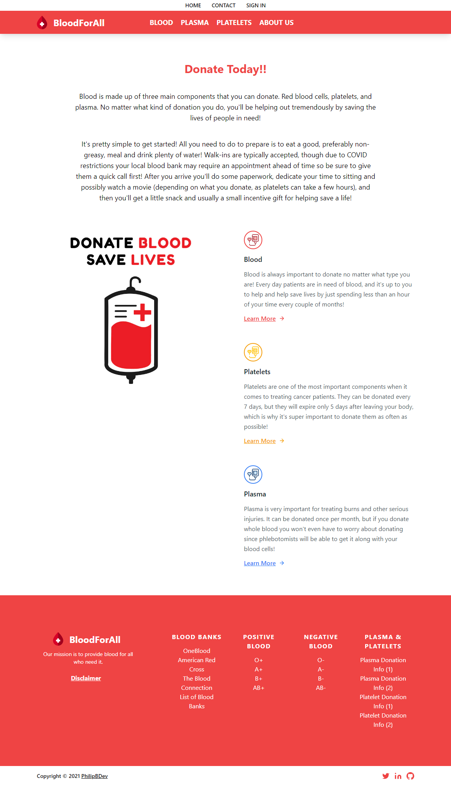

  <h3 align="center">BloodForAll</h3>

  <p align="center">
    <br />
   <a href="https://blood-for-5va8mvx54-philipbdev.vercel.app/">View Demo</a> 
    •
    <a href="https://github.com/PhilipBDev/BloodForAll/issues">Report Bug</a>
    •
    <a href="https://github.com/PhilipBDev/BloodForAll/issues">Request Feature</a>
    </p>

<p align="center">
    <a href="https://blood-for-5va8mvx54-philipbdev.vercel.app/">
    
  </a>
</p>

<!-- TABLE OF CONTENTS -->
<details open="open">
  <summary><h2 style="display: inline-block">Table of Contents</h2></summary>
  <ol>
    <li>
      <a href="#about-the-project">About The Project</a>
      <ul>
        <li><a href="#built-with">Built With</a></li>
      </ul>
    </li>
    <li>
      <a href="#getting-started">Getting Started</a>
      <ul>
        <li><a href="#installation">Installation</a></li>
      </ul>
    </li>
    <li><a href="#roadmap">Roadmap</a></li>
    <li><a href="#license">License</a></li>
    <li><a href="#contact">Contact</a></li>
    <li><a href="#resources">Resources</a></li>
  </ol>
</details>

<!-- ABOUT THE PROJECT -->

## About The Project

BloodForAll would be the groundwork for either a blood bank or a blood donation informational resource. The goal of this application was to learn the structure of Next.js and use Tailwind to create responsive layouts.

Auth0 was also implemented to see how it worked compared to creating a user database using Node.js. Chart.js was utilized to create an interactive chart on the blood donation page just to make the site a little more pleasent to look at.

While using Tailwind I've learned that it's best to create layouts with mobile first in mind. Building a layout for desktop users and trying to make it work on mobile is way more of a headache than the other way aroud. Learning the shortcuts for Tailwind wasn't too difficult thanks to the 'Tailwind CSS Intellisense' plugin for VSCode.

I used Vercel to host the website (since they created Next.js) for the first time, and much like Netlify it was fairly simple to set up.

### Built With

- [Next.js](https://nextjs.org/)
- [Tailwind CSS](https://tailwindcss.com/)

- [Auth0](https://auth0.com/)
- [Chart.js](https://www.chartjs.org/)

<!-- GETTING STARTED -->

## Getting Started

To get a local copy up and running follow these simple steps.

### Installation

1. Clone the repo
   ```sh
   git clone https://github.com/PhilipBDev/BloodForAll.git
   ```
2. Install NPM packages
   ```sh
   npm install
   ```
3. Create an ENV file with the following attributes to set up Auth0 properly:

   ```sh
   AUTH0_SECRET=
   AUTH0_BASE_URL='http://localhost:3000'
   AUTH0_ISSUER_BASE_URL=
   AUTH0_CLIENT_ID=
   AUTH0_CLIENT_SECRET=
   ```

<!-- ROADMAP -->

## Roadmap

See the [open issues](https://github.com/PhilipBDev/BloodForAll/issues) for a list of proposed features (and known issues).

<!-- LICENSE -->

## License

Distributed under the MIT License. See `LICENSE` for more information.

<!-- CONTACT -->

## Contact

Your Name - [@PhilipBDev](https://twitter.com/PhilipBDev) - PhilipBDev@gmail.com

Project Link: [https://github.com/PhilipBDev/BloodForAll](https://github.com/PhilipBDev/BloodForAll)

<!-- RESOURCES -->

## Resources

- [Vercel](https://vercel.com/)
- [Namecheap](https://www.namecheap.com/)
